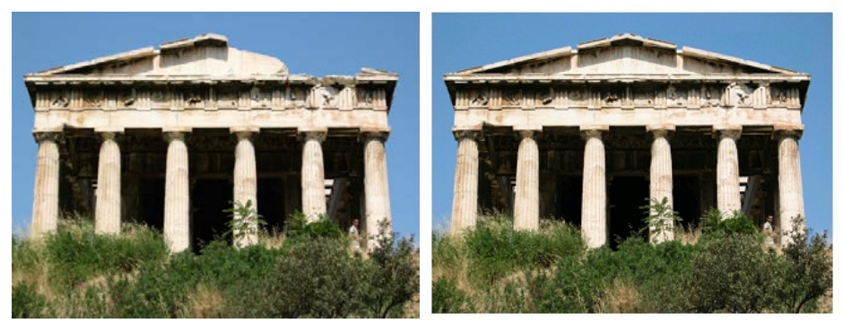
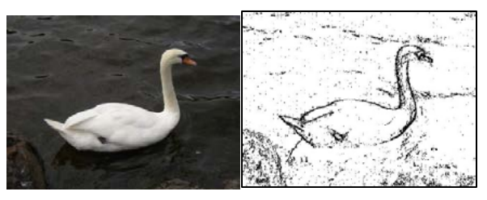

---
jupytext:
  formats: md:myst
  text_representation:
    extension: .md
    format_name: myst
rise:
  start_slideshow_at: beginning

kernelspec:
  display_name: Python 3
  language: python
  name: python3
---

# 期末大作业II #

## 任务一：图片镜像 ##

完美对称的图形和建筑随处可见。如果我们在图片宽度的中心线上放置一面镜子，将左侧反射出来会是什么样子？


怎样实现左右镜像的功能？我们知道图片是一个二维列表，只需要沿着列表中轴线，将列表左边的像素值复制到右边即可实现镜像功能。


```{code-cell} python3
import cv2
from IPython.display import Image

def mirror(img):
  img_width = img.shape[1]  # image width
  img_height = img.shape[0]  # image height
  for row in range(img_height):
    for col in range(img_width//2):
      leftPixel = img[row, col]
      img[row,img_width-1-col] = leftPixel
  return img

img = cv2.imread('caterpillar.jpeg')
newImage = mirror(img)
cv2.imwrite("1.jpeg", newImage)
Image(filename='caterpillar.jpeg') 
Image(filename='1.jpeg') 
```

参考以上代码，完成下列函数：

1-1：示例函数是将图片从左向右镜像，设计函数mirrorVerticalRightToLeft，使图片从右向左镜像。图片可以点击{download}`毛毛虫 <caterpillar.jpeg>`下载。

1-2：设计函数mirrorHorizontal，使得图片从上向下镜像，如下图所示：


你可以使用毛毛虫的图片，也可以使用{download}`红色摩托车 <redMotorcycle.jpeg>`。

[附加题]1-3: 左图是一座希腊神庙，由于岁月的侵蚀，神庙的顶部已经破损。设计函数fix，修复这座希腊神庙的屋顶。修复后的效果应如右图所示：


{download}`神庙图片 <temple.jpeg>`

1-3需要对图片的部分进行镜像处理。为了找到镜像的位置，你可以借助https://pixspy.com/。

## 任务二：边缘检测 ##

边缘检测（edge detection)是一个常见的图像处理问题。例如，数码相机通常具有人脸特征检测功能。一些机器人比赛要求机器人使用数码相机找到球，因此机器人需要能够“看到”一个球的轮廓。

在图片中寻找边缘的一种方法是：将当前像素的颜色与右边的像素进行比较。如果颜色的差异超过某个值，则表明已检测到边缘，当前像素颜色应设置为黑色。否则，当前像素是不是边缘的一部分，其颜色应设置为白色（如下图所示）。

如何计算颜色差异呢？在坐标系中，两个点(x1,y1), (x2, y2)的位置差异可以用它们之间的欧几里得距离来表示： $\sqrt{(x2-x1)^2+(y2-y1)^2}$。两个颜色(Blue1, Green1, Red1), (Blue2, Green2, Red2)之间的差异可以表示称：$\sqrt{(Blue2-Blue1)^2+(Green2-Green1)^2+(Red2-Red1)^2}$。



edge()函数是一个示例程序，它除了img参数外，还有一个参数叫做dist，用来指定图片边缘所对应的色彩差异程度。用户需要根据图片的风格和特点来调整dist参数，以实现最好的检测效果。

```{code-cell} python3
def edge(img, dist):
    img_width = img.shape[1]  # image width
    img_height = img.shape[0]  # image height
    for i in range(img_height):
        for j in range(img_width-1):
            currentPixel = img[i,j]   #当前像素
            nextPixel = img[i,j+1]    #右边像素
            diff = colorDiff(currentPixel, nextPixel)
            if(diff > dist):          #检测到轮廓
                img[i,j] = [0,0,0]
            else:                     #未检测到轮廓
                img[i,j] = [255,255,255]
    return img

def colorDiff(p1, p2):
    b1, g1, r1 = int(p1[0]),int(p1[1]),int(p1[2])
    b2, g2, r2 = int(p2[0]), int(p2[1]), int(p2[2])
    return math.sqrt(math.pow((b2-b1),2) + math.pow((g2-g1),2) + math.pow((r2-r1),2))

```
你需要做的事情：

2-1. 测试edge函数，将{download}`天鹅 <swan.jpeg>`的边缘检测出来，并且显示边缘的图片（如上图所示）。
2-2. 设计函数edgeUpDown，通过比较像素和它下方的像素点的差值，来实现边缘检测功能。

## 任务三：图片滤镜 ##

Instagram和SnapChat这种软件通过它们的滤镜吸引了无数用户。你的最终任务是设计一个独一无二的图像滤镜。滤镜风格不限，你既可以选择对风景照进行艺术加工，也可以设计一个可爱的人像滤镜。

一些idea供参考：

1. 人像的脸部自动美白
2. 在头部带上圣诞头饰
3. 在鼻子上"安装"上宠物的鼻子
4. 将天空变为"火烧云"
5. 在照片边缘加上贴纸图案
6. 将图片变为冷/暖/复古/金属风的色调
......

你设计的滤镜需要满足以下要求：

1. 你的滤镜不能仅仅处理你的某张图片，它需要可以被所有人来使用！
2. 在提交之前，确认你的滤镜函数可以运行。如果运行不成功则没有分数。所以一定要测试！测试！再测试！
3. 给你的滤镜取一个酷炫的名字（中英文不限）


## 期末大作业报告 ##

你需要提交一份报告来介绍你的期末成果。报告至少包括如下几块内容：

标题和姓名：标题自拟

摘要：简要介绍期末大作业实验的内容、方法和结果。

引言：介绍图像编码和图像处理的背景知识，并解释图像处理的实际意义。

实验方法和结果：依次描述各项任务的完成过程，包括使用的图片和算法。详细介绍任务的结果，包括你的代码和生成的图片。

讨论：对大作业完成过程中出现的问题进行讨论和反思。

结论：总结大作业的成果和收获。

